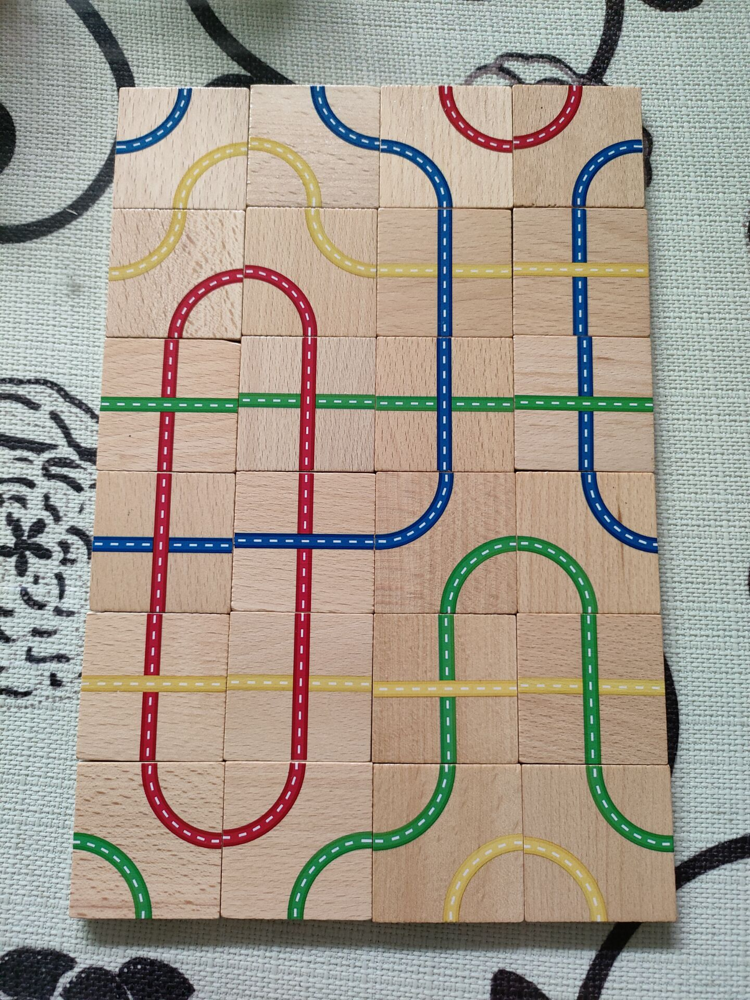
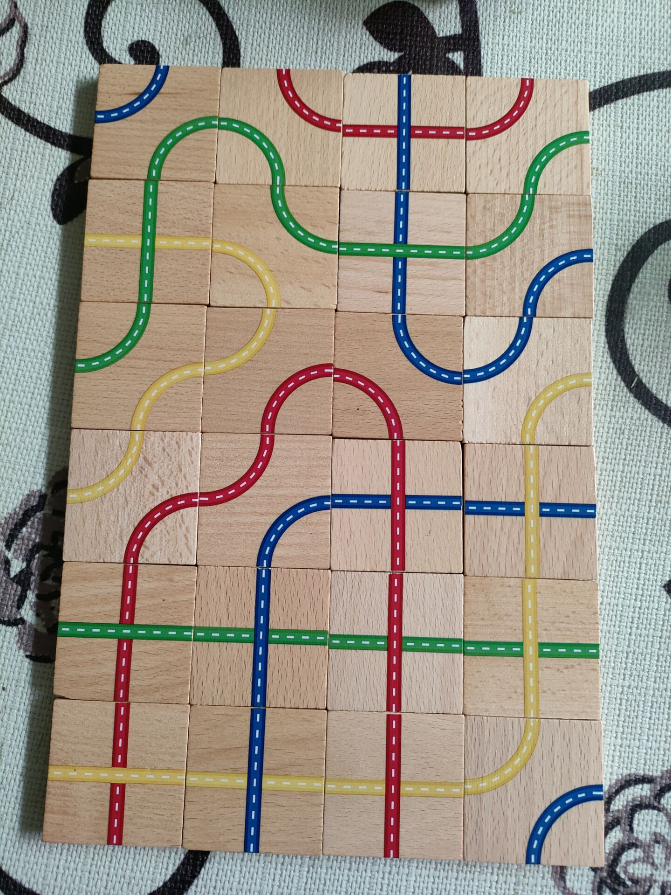

## Rainbow Bridge Puzzle Problem

simple dfs algorithm to solve my four-years-old niece's puzzle game...😝

## results:

``` TEXT
Arch, BlueYellow, angle: 0
Arch, BlueYellow, angle: 90
Arch, RedBlue, angle: 90
Arch, RedBlue, angle: 0

 
Arch, RedYellow, angle: 180
Arch, RedYellow, angle: 270
Cross, BlueYellow, angle: 90
Cross, BlueYellow, angle: 90

 
Cross, RedGreen, angle: 90
Cross, RedGreen, angle: 90
Cross, BlueGreen, angle: 90
Cross, BlueGreen, angle: 90

 
Cross, RedBlue, angle: 90
Cross, RedBlue, angle: 90
Arch, BlueGreen, angle: 0
Arch, BlueGreen, angle: 90

 
Cross, RedYellow, angle: 90
Cross, RedYellow, angle: 90
Cross, GreenYellow, angle: 90
Cross, GreenYellow, angle: 90

 
Arch, RedGreen, angle: 90
Arch, RedGreen, angle: 0
Arch, GreenYellow, angle: 0
Arch, GreenYellow, angle: 90
```


``` TEXT
Arch, BlueGreen, angle: 0
Arch, RedGreen, angle: 90
Cross, RedBlue, angle: 0
Arch, RedGreen, angle: 0

Cross, GreenYellow, angle: 90
Arch, GreenYellow, angle: 90
Cross, BlueGreen, angle: 90
Arch, BlueGreen, angle: 180

Arch, GreenYellow, angle: 0
Arch, RedYellow, angle: 180
Arch, RedBlue, angle: 270
Arch, BlueYellow, angle: 0

Arch, RedYellow, angle: 180
Arch, RedBlue, angle: 0
Cross, RedBlue, angle: 90
Cross, BlueYellow, angle: 0

Cross, RedGreen, angle: 90
Cross, BlueGreen, angle: 90
Cross, RedGreen, angle: 90
Cross, GreenYellow, angle: 0

Cross, RedYellow, angle: 90
Cross, BlueYellow, angle: 90
Cross, RedYellow, angle: 90
Arch, BlueYellow, angle: 180
```


